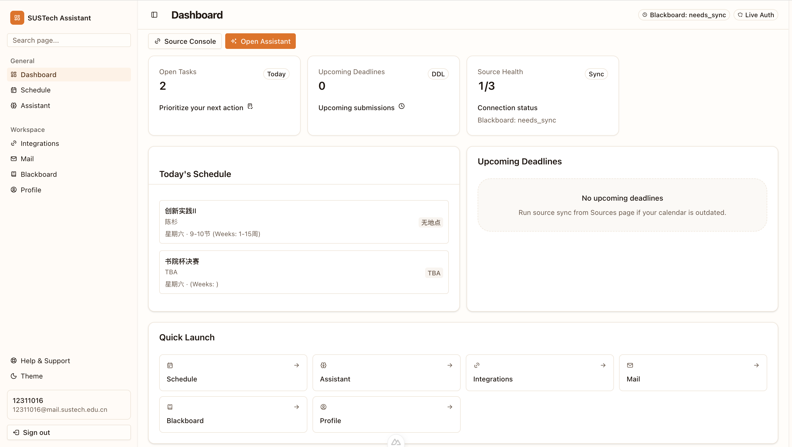
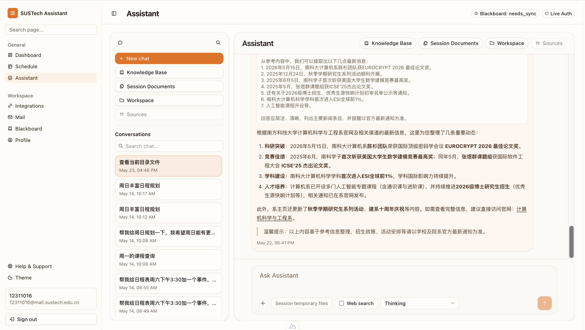
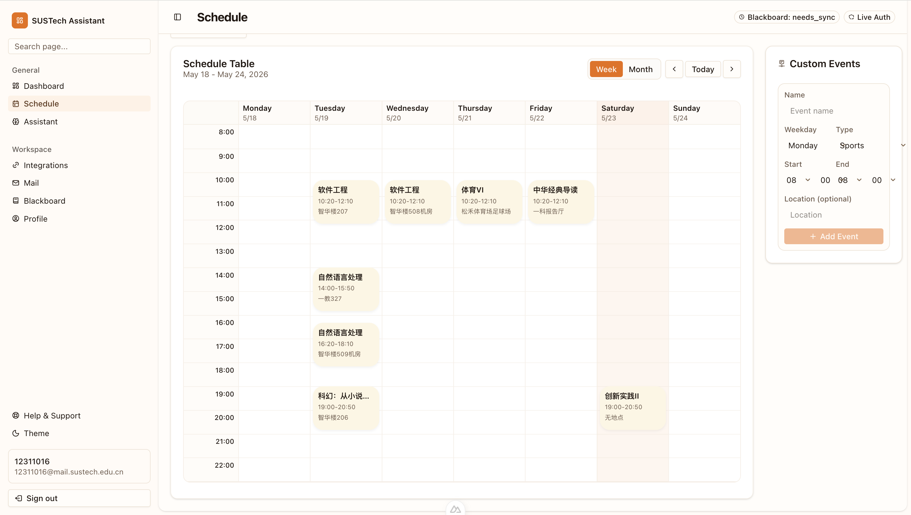
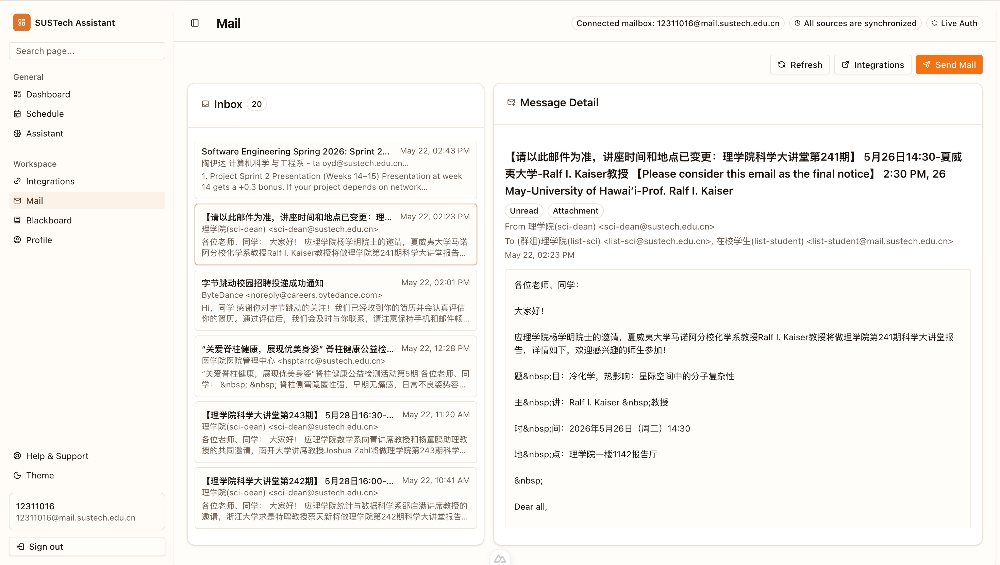

# Student Productivity Agent

Student Productivity Agent is a full-stack assistant system for students. It combines course data, schedules, chat-based assistance, document understanding, and mailbox-related workflows into one interface.

The repository contains:

- `frontend/`: Nuxt 3 + Vue 3 web client
- `backend/`: FastAPI backend, agent logic, database integration, Redis cache, and Elasticsearch-based retrieval support
- `assets/`: interface snapshots and design assets
- `docs/`: project notes and API-related documents

## Key Features

- Conversational AI assistant for everyday academic support
- Document-aware Q&A over uploaded study materials
- Web-assisted answering for questions that require current online information
- Mail drafting and confirmation-based sending through the assistant
- Schedule querying and assisted schedule updates with user confirmation
- Blackboard synchronization for course-related information
- TIS synchronization for student and academic records
- Integrated mailbox access for syncing, reading, and managing messages
- Unified student workspace for information overview and quick access

## Interface Preview

### Dashboard



### Assistant



### Schedule



### Mail Box


## Tech Stack

- Frontend: Nuxt 3, Vue 3, TypeScript, Pinia, Tailwind CSS
- Backend: FastAPI, SQLAlchemy, Uvicorn
- Data services: PostgreSQL, Redis, Elasticsearch
- AI / document stack: OpenAI-compatible APIs, embedding/rerank integrations, document parsing pipeline

## Installation and Setup

### 1. Clone the repository

```bash
git clone <your-repo-url>
cd team-project-26spring-26s-4
```

### 2. Prepare the backend environment

```bash
cd backend
python -m venv .venv
source .venv/bin/activate
pip install -r requirements.txt
cp .env.example .env
```

Then edit `backend/.env` and fill in the required configuration values.

Important variables include:

- `SUSTECH_ASSISTANT_DATABASE_URL`
- `SUSTECH_ASSISTANT_SECRET_KEY`
- `DASHSCOPE_API_KEY`
- `EMBEDDING_API_KEY`
- `RERANK_API_KEY`
- `REDIS_HOST`, `REDIS_PORT`
- `ES_HOST`

### 3. Prepare the frontend environment

```bash
cd ../frontend
npm install
```

If needed, configure the frontend backend URL with:

- `NUXT_PUBLIC_API_BASE=http://localhost:9000`

## How to Run

### Backend quick start

Start infrastructure services first:

```bash
cd backend
docker compose up -d gsk_pg redis es01
```

Then start the backend application:

```bash
python app/main.py
```

Backend default address:

- `http://127.0.0.1:9000`

Useful endpoints:

- Health check: `http://127.0.0.1:9000/health`
- Swagger UI: `http://127.0.0.1:9000/docs`
- ReDoc: `http://127.0.0.1:9000/redoc`

### Frontend development server

In another terminal:

```bash
cd frontend
npm run dev
```

Frontend default address:

- `http://localhost:3000`

## Quick Usage Examples

### Example 1: verify the backend is running

Open:

- `http://127.0.0.1:9000/health`

Expected response:

```json
{"status":"ok"}
```

### Example 2: open the web app

1. Start backend services and backend app
2. Start the frontend with `npm run dev`
3. Visit `http://localhost:3000`

### Example 3: explore the API

1. Start the backend
2. Open `http://127.0.0.1:9000/docs`
3. Try endpoints under:
   - `/api/v1/auth`
   - `/api/v1/chat`
   - `/api/v1/history`
   - `/api/v1/mail`
   - `/api/v1/schedule`
   - `/api/v1/sync`
   - `/api/v1/tis`
   - `/api/v1/user`

## Project Structure

```text
team-project-26spring-26s-4/
├── README.md
├── assets/
├── docs/
├── frontend/
└── backend/
    ├── app/
    ├── docker-compose.yml
    ├── requirements.txt
    └── .env.example
```

## Known Issues and Limitations

- Some integrations depend on external campus systems or third-party APIs, so availability may vary.
- The backend requires several environment variables and API keys before all AI-related features will work correctly.
- Elasticsearch can take a short time to become healthy after startup.
- Mail and external sync features may require valid account credentials and stable network access.

## Additional Resources

- Backend API docs: `http://127.0.0.1:9000/docs`
- Frontend notes: [frontend/README.md](frontend/README.md)
- Architecture and UI design: [design-4.md](design-4.md)
- Project report: [final-report-26s-4.md](final-report-26s-4.md)

## Recommended Startup Order

For local development, use this order:

```bash
cd backend
docker compose up -d gsk_pg redis es01
python app/main.py
```

If you also want the web UI:

```bash
cd frontend
npm run dev
```
