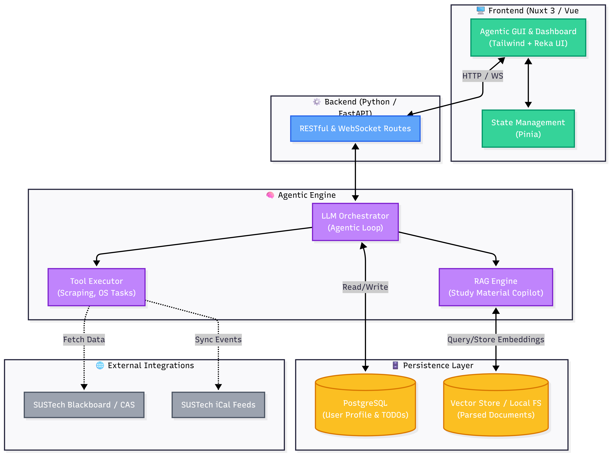
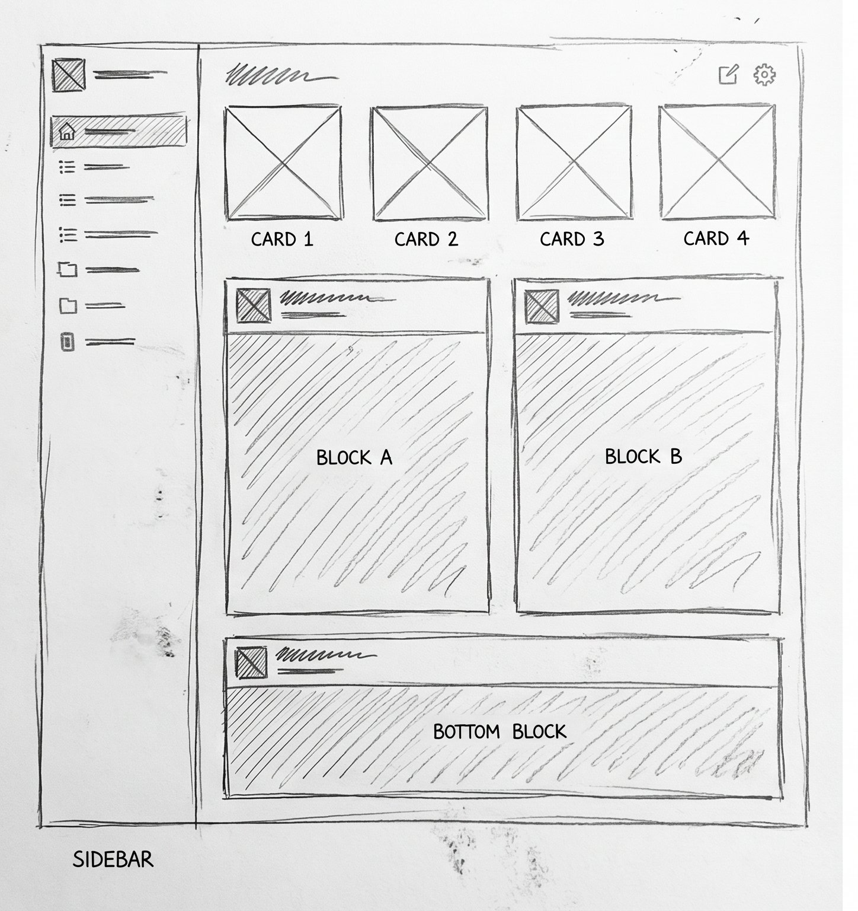
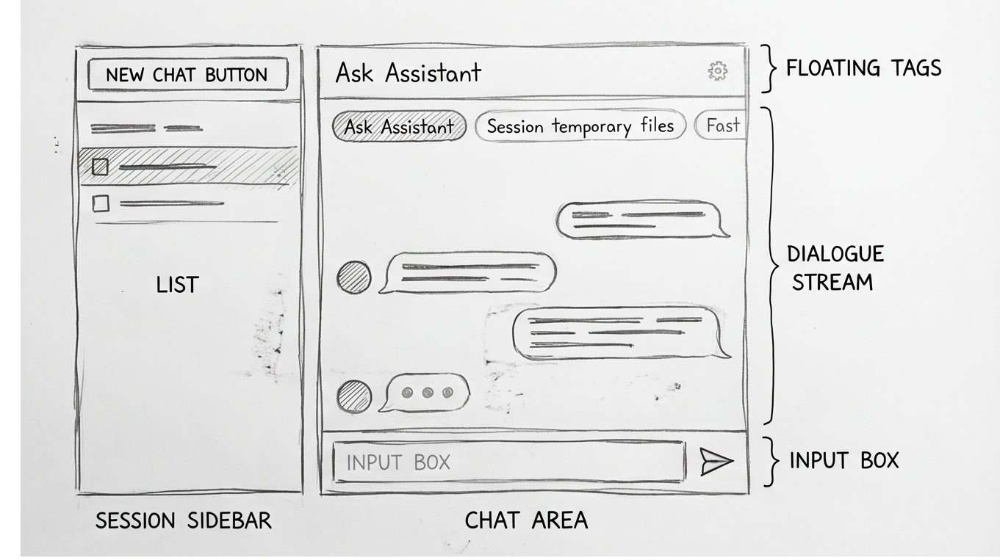
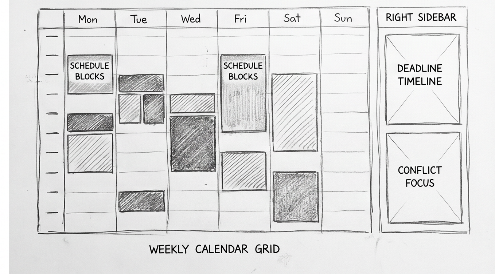

# Sprint 1 Architecture & UI Design Report

**Team:** 26S Team 4 (Student Productivity Agent)
**Date:** 2026-04-17

---

## 1. Architectural Design

### 1.1 Architecture Diagram

### 1.2 Architectural Description

The architecture of the **Student Productivity Agent** follows a modern decoupled Client-Server model, heavily driven by an Agentic Core on the backend and a reactive framework on the frontend. 

**1. Frontend Architecture (Nuxt 3 & Vue 3 Ecosystem)**
The user interface is built as a single-page/server-side-rendered hybrid application using **Nuxt 3** and **Vue 3**.
*   **Core Framework**: We utilize Nuxt 3 with TypeScript to ensure strict type safety and a well-organized directory structure (e.g., auto-imported `composables`, `components`, and `pages`).
*   **State Management**: **Pinia** is used as the centralized store to manage global states, such as the user's academic profile, current active tasks, and the real-time status of the Agent's thought processes.
*   **UI & Styling**: The styling is purely utility-first, powered by **Tailwind CSS v4**. For accessible and customizable UI components, we integrate **Reka UI** (a headless component library) combined with utility functions like `clsx` and `tailwind-merge` for dynamic class assignment.
*   **Data Visualization & Interaction**: We use `@unovis/vue` for rendering any data-driven charts in the dashboard, `@tanstack/vue-table` for complex data tables (like assignment deadlines), and `@dnd-kit/abstract` (with `dnd-kit-vue`) to support drag-and-drop interactions, which is especially useful for the Study Material Copilot module.

**2. Backend Architecture (Python & FastAPI)**
*   **API Gateway & Controller**: The backend is built with **FastAPI** (Python 3.10+), providing high-performance asynchronous RESTful APIs. It acts as the bridge between the Nuxt 3 frontend and the AI core.
*   **Agentic Core**: This is the brain of the system. Instead of rigid programmed logic, the backend implements an Agentic Loop (using an LLM). The Agent dynamically decides which "Tools" to invoke based on user prompts. These tools include:
    *   *Scraping Tools*: To fetch Blackboard and CAS data.
    *   *System Tools*: To interact with local OS file directories for automated task management.
    *   *RAG Engine*: To query vector-stored documents like the SUSTech University Calendar.

**3. Data Storage**
*   **PostgreSQL**: Serves as the primary relational database to store persistent user data, such as personal TODOs and the context-aware student profiling metrics.
*   **Document Storage/Vector DB**: Handles the parsed text embeddings from uploaded lecture PPTs, Markdown notes, and official handbooks to support the Retrieval-Augmented Generation (RAG) feature.

**4. External Integrations**
The Agent actively monitors external APIs and data streams:
*   **iCal Feeds**: For syncing SUSTech academic calendar events.
*   **Blackboard & CAS**: For authenticating and retrieving course-specific data.

### 1.3 Hidden Assumptions

While the architecture diagram illustrates the explicit components and data flows of the Student Productivity Agent, several implicit assumptions are critical for the system to function as designed:

1. **Local Deployment for File System Access:** 
   The architecture includes a "System-Level Task Automator" designed to perform OS-level tasks (e.g., batch-renaming local lab submission files). This inherently assumes that the Python backend (or a dedicated local daemon) is running locally on the user's machine with sufficient Read/Write privileges to the file system, rather than being deployed purely as an isolated Cloud SaaS where local file access would be prohibited.

2. **External System Stability (Web Scraping):** 
   The "Multi-Source Integration" relies on fetching data from SUSTech Blackboard and CAS. Since these legacy systems may not provide modern RESTful APIs, the architecture assumes that the DOM structure, authentication workflows, and internal endpoints of the university's IT systems remain stable and unchanged. Any unannounced update by the university IT department could break the scraping pipeline.

3. **Network & LLM API Availability:** 
   The "Agentic Core" relies heavily on external Large Language Model APIs (e.g., OpenAI) for its reasoning capabilities (Agentic Loop). The architecture assumes stable, low-latency, and unrestricted network access to these third-party endpoints. Furthermore, it assumes the LLM can consistently output strictly formatted structural data (e.g., JSON) to accurately trigger the Tool Executor without hallucinating parameters.

4. **Human-in-the-Loop Security Compliance:** 
   To meet the "Safety & Security" non-functional requirement, the architecture assumes that whenever the Agent attempts a write-operation (like modifying a local calendar or renaming a file), the execution pauses for user confirmation via the Vue 3 GUI. It is assumed that users will actively review the Agent's "Thought Trace" before authorizing actions, rather than bypassing security prompts.
---

## 2. UI Design

### 2.1 Primary UI: Dashboard (Multi-Source Productivity Dashboard)
**Description & Layout Strategy:**
The Dashboard is designed as the central hub for student productivity. Following a highly structured layout:
*   **Top KPI Row:** Displays four core metric cards: Open Tasks, Conflict Count, Pending Approvals, and Source Health.
*   **24h Preview & Top Conflicts:** The middle section lists up to 5 upcoming deadlines or schedule items within 24 hours. The Conflict Card highlights the top 3 schedule conflicts (e.g., overlapping classes and assignment deadlines) and provides a one-click "suggested action" button.
*   **Routing CTAs:** The bottom section provides quick-launch buttons to navigate to specific modules (like Study or Assistant) without cluttering the dashboard with heavy operations.

### 2.2 Primary UI: Assistant (Agentic GUI with Thought Trace)
**Description & Layout Strategy:**
The Assistant interface is the core Agentic GUI, designed with a strict Human-in-the-Loop policy.
*   **Split Layout:** The left sidebar manages conversation history, while the main right area handles the active chat.
*   **Dynamic Thought Trace:** To prevent overwhelming non-technical students, the Agent's "Thought Trace" (showing API calls and backend logic) is designed to appear *only* during the streaming phase and automatically disappears once the final response is generated.
*   **Approval Cards:** Whenever the Agent proposes a system-level action (e.g., renaming a file or modifying the calendar), a pending Approval Card appears directly within the message stream. The user can click "Approve" (executes immediately) or "Reject" (with optional predefined reason tags).

### 2.3 Primary UI: Schedule (Conflict-Aware Calendar)
**Description & Layout Strategy:**
A newly introduced dedicated page for managing academic timelines, integrating data from both `tis/schedule` and `bb/calendar`.
*   **View Modes:** Supports both Weekly and Monthly views with smooth, reduced-motion transitions. The Week view is fixed at 10 slots per day (Mon-Sun).
*   **Conflict Rendering:** Schedule conflicts are calculated locally on the frontend and visually graded by severity (High/Medium/Low). 
*   **Agent Integration:** A standout UI feature is the "Send to Assistant" button attached to conflict items, allowing users to seamlessly forward conflict context (event IDs, time windows) to the Agent for resolution advice.

