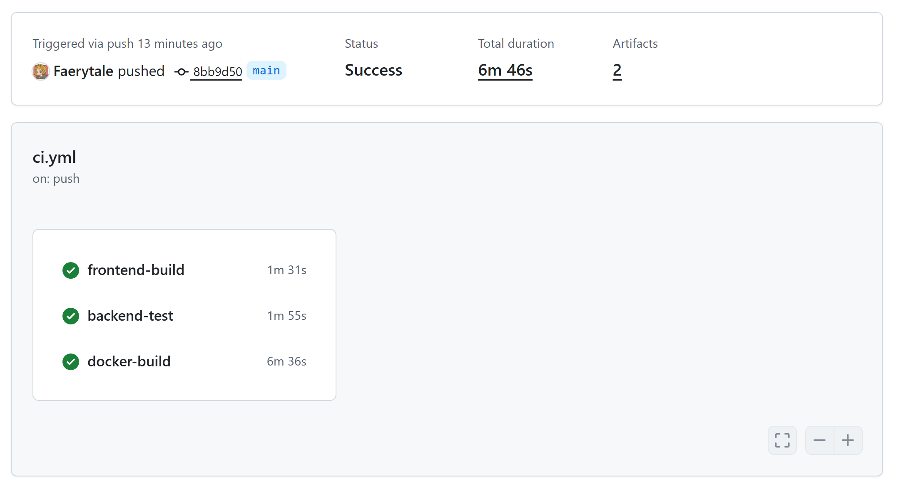

# Team Report - 26s-4

## 1. 指标 (Metrics)

我们使用 [lizard](https://github.com/terryyin/lizard) 工具来计算以下复杂度指标。lizard 能够分析源文件并统计有效代码行数（NLOC）、圈复杂度（CCN）以及每个函数的 token 数量。

### 项目整体概览

| 指标 | 后端 (Python) | 前端 (Vue/TS/CSS) | 合计 |
|--------|:-----------:|:-------------:|:-----:|
| 代码行数 (NLOC) | 17,063 | 10,773 | **27,836** |
| 源文件数量 | 116 | 174 | **290** |
| 函数数量 | 739 | 730 | **1,469** |
| 平均圈复杂度 | 5.5 | 2.6 | — |
| 依赖项数量 | 47 | 23 | **70** |

### 分项说明

**代码行数**：使用 `lizard` 计算 NLOC（不含注释和空行的有效逻辑行）。后端的 Python 代码承载了主要的业务逻辑，共计 17,063 行，分布在 116 个文件中；前端共计 10,773 行，分布在 174 个文件中（包含 Vue 单文件组件、TypeScript 模块和 CSS 样式文件）。

**圈复杂度**：后端平均 CCN 为 5.5，其中 42 个函数被标记为高复杂度（CCN > 15）。最复杂的模块位于 `deepdoc/vision/table_structure_recognizer.py`（CCN 最高 109）和 `deepdoc/parser/resume/step_two.py`（CCN 最高 95），二者均处理复杂的文档解析逻辑。前端平均 CCN 为 2.6，有 11 个警告，主要集中在 workspace store（`useWorkspaceStore.ts`）和 API client（`useApiClient.ts`）。

**依赖项数量**：后端使用 47 个 Python 包（FastAPI、SQLAlchemy、Elasticsearch、OpenAI 等），前端使用 23 个 npm 包（Nuxt 3、Vue 3、Pinia、Tailwind CSS 等）。

---

## 2. CI/CD Pipeline Description

由于 sustech-cs304 组织的 GitHub 账户存在 Actions 额度限制，我们将仓库 Fork 到了个人账户下进行 CI/CD 流水线的运行与测试。
- **个人 Fork 仓库地址**: https://github.com/Faerytale/team-project-26spring-26s-4
- **Workflow 配置文件链接**: https://github.com/sustech-cs304/team-project-26spring-26s-4/blob/main/.github/workflows/ci.yml

### 流水线步骤与使用工具 (Steps and Tools)

我们的 CI/CD 流水线在向 `main` 或 `master` 分支提交代码时自动触发，包含前端、后端和 Docker 构建三个并行的 Job：

1. **前端构建与打包 (Frontend Build)**
   - **Checkout & Setup**: Checkout 代码并使用 `setup-node` 安装 Node.js v20。
   - **依赖安装**: 使用 `npm install` 安装前端项目所需的各类依赖。
   - **编译源代码与打包 (Compile & Package)**: 执行 `npm run build`。该步骤使用 **Nuxt/Vite** 框架将 Vue 源代码编译打包生成静态产物及服务端渲染文件。
   - **产物留存**: 使用 `actions/upload-artifact@v4` 工具，将生成的 `.output` 目录打包归档为 `frontend-package`。该产物为独立的、可运行的前端构建版本，可直接部署到生产服务器或通过 Node.js 运行。

2. **后端环境与测试 (Backend Test)**
   - **Checkout & Setup**: Checkout 代码并使用 `setup-python` 安装 Python 3.10 环境。
   - **Python 语法检查 (Syntax Check)**: 使用 `python -m compileall` 对 `app/` 目录下所有 Python 源文件进行编译检查，在依赖安装之前快速发现语法错误（fail-fast）。
   - **依赖安装**: 更新 pip 并安装所需依赖库（pytest 及 requirements.txt）。
   - **运行测试 (Run tests)**: 使用 **pytest** 测试框架并配合 `--junitxml` 参数执行后端的自动化单元测试，同时生成 JUnit XML 格式的测试报告。
   - **测试报告存档 (Upload Test Report)**: 使用 `actions/upload-artifact@v4` 将 `test-report.xml` 上传为 `test-report` artifact，可供下载和后续分析。
   - **测试结果展示 (Publish Test Results)**: 使用 `dorny/test-reporter@v1` 将 JUnit 报告解析后在 GitHub Checks UI 中直接展示通过/失败统计。

3. **Docker 镜像构建 (Docker Build)**
   - **Checkout & Setup**: Checkout 代码并配置 `docker/setup-buildx-action@v3` 启用 Buildx 构建器。
   - **构建后端镜像**: 使用 `docker/build-push-action@v6` 基于 `backend/Dockerfile` 构建后端 Docker 镜像（`push: false`，仅验证可构建性）。
   - **缓存优化**: 利用 GitHub Actions Cache (`type=gha`) 加速依赖层缓存，减少后续构建时间。
   - **可运行产物**: 通过此步骤验证了项目被打包为可独立运行的容器化应用（Runnable Artifact）的能力，为后续的容器化部署（如部署到 Kubernetes）奠定了基础。

### 成功执行证明

下图展示了我们在 GitHub Actions 中成功触发并顺利通过前端构建、后端测试（含语法检查与测试报告）以及 Docker 镜像构建三个 Job 的记录：

